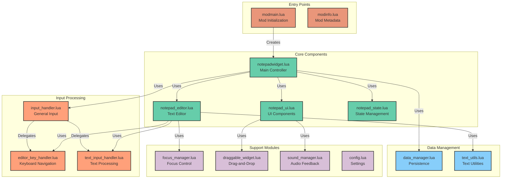
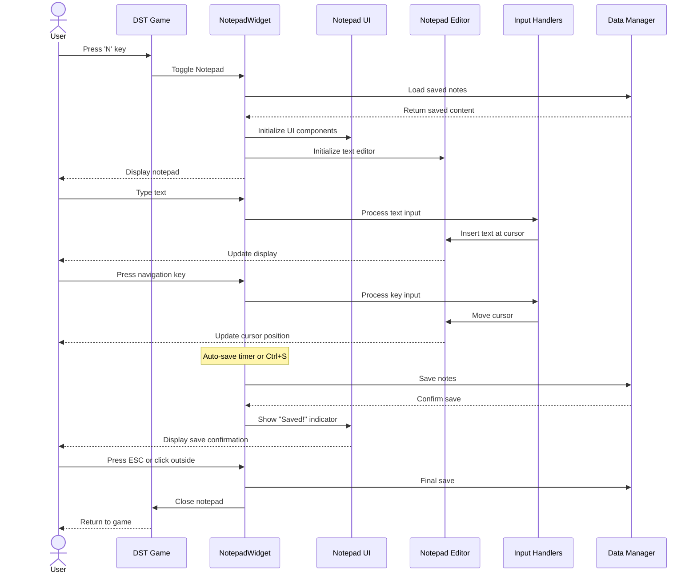
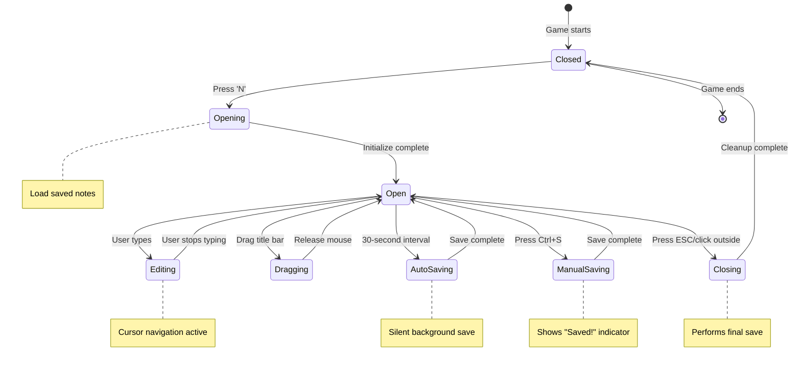
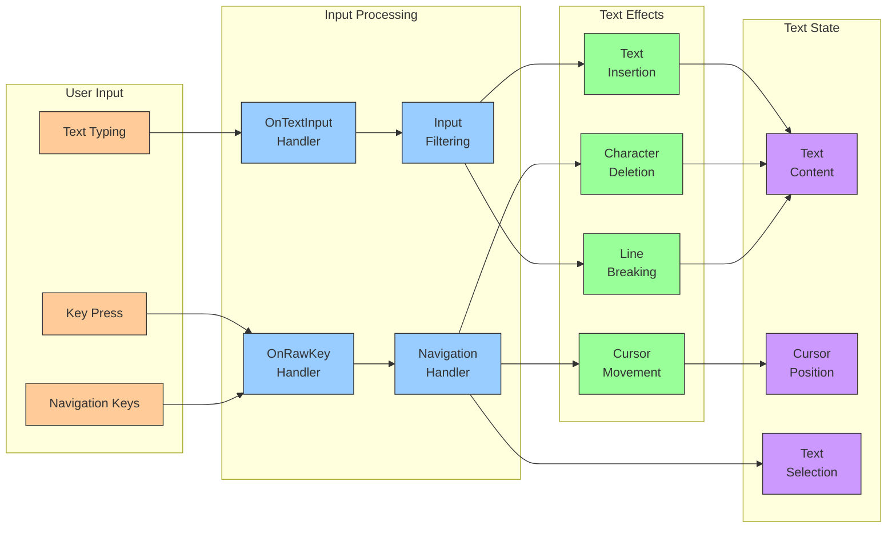
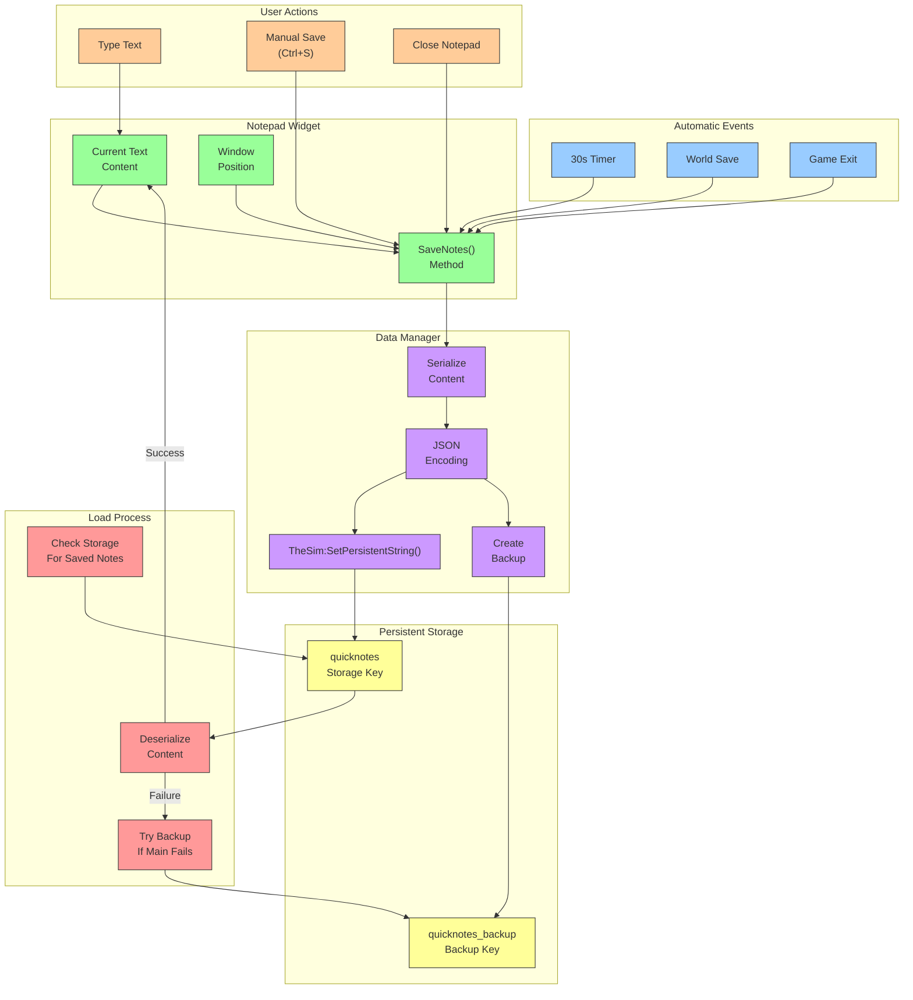
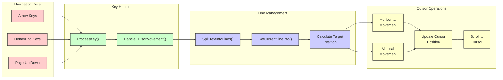

# QuickNotes: Visual Architecture Guide

This document provides visual explanations of the QuickNotes mod structure and workflows using intuitive diagrams. These visualizations help understand how the different components interact to create a seamless notepad experience in Don't Starve Together.

## Module Architecture

The diagram below shows the main components of QuickNotes and how they relate to each other:



## User Interaction Flow

This diagram shows the journey of user inputs through the system:



## Notepad States and Transitions

This state diagram shows the lifecycle of the notepad and its possible states:



## Text Input and Cursor Management

This diagram shows how text input and cursor management work in the editor:



## Data Flow and Persistence

This diagram shows how note data is saved and loaded:



## UI Component Hierarchy

This diagram shows the UI component structure:

```mermaid
flowchart TD
    %% UI Component hierarchy
    Screen["Screen\n(Base Class)"]
    NotepadWidget["NotepadWidget\n(Main Screen)"]
    
    Screen --> NotepadWidget
    
    subgraph UIComponents["UI Components"]
        Root["Root Widget\n(Container)"]
        BG["Background\n(Clickable Area)"]
        BGShadow["Background Shadow\n(Visual Depth)"]
        Frame["Frame\n(Border)"]
        TitleBar["Title Bar\n(Draggable)"]
        TitleText["Title Text\n(\"Quick Notes\")"]
        CloseBtn["Close Button\n(X)"]
        ResetBtn["Reset Button\n(Rotated X)"]
        SaveIndicator["Save Indicator\n(Feedback)"]
    end
    
    subgraph EditorComponents["Editor Components"]
        EditorWidget["Editor Widget\n(Text Container)"]
        TextEdit["TextEdit\n(DST Widget)"]
        InputHandlers["Custom Input\nHandlers"]
    end
    
    NotepadWidget --> Root
    Root --> BG
    Root --> BGShadow
    Root --> Frame
    Root --> TitleBar
    TitleBar --> TitleText
    Root --> EditorWidget
    Root --> CloseBtn
    Root --> ResetBtn
    Root --> SaveIndicator
    
    EditorWidget --> TextEdit
    EditorWidget --> InputHandlers
    
    %% Visual styling
    classDef base fill:#ffcccc,stroke:#333,stroke-width:1px
    classDef main fill:#ccffcc,stroke:#333,stroke-width:1px
    classDef ui fill:#ccccff,stroke:#333,stroke-width:1px
    classDef editor fill:#ffffcc,stroke:#333,stroke-width:1px
    
    class Screen base
    class NotepadWidget main
    class Root,BG,BGShadow,Frame,TitleBar,TitleText,CloseBtn,ResetBtn,SaveIndicator ui
    class EditorWidget,TextEdit,InputHandlers editor
```

## Keyboard Navigation System

This diagram shows how keyboard navigation works in the editor:



These diagrams provide a comprehensive visual overview of the QuickNotes mod architecture, workflows, and component relationships. They illustrate how the different modules interact to create a functional, persistent notepad in Don't Starve Together.